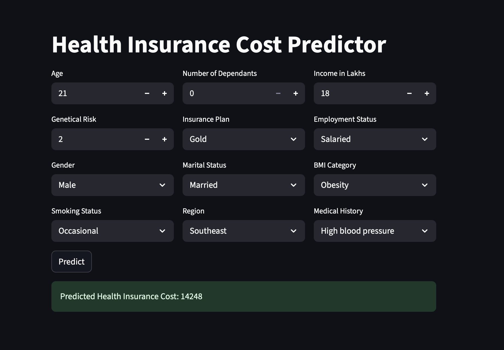

# 🏥 Health Insurance Premium Prediction - Advanced ML Pipeline

This project focuses on **predicting annual health insurance premiums** using demographic, financial, and health-related features. It includes robust **EDA**, **Feature Engineering**, **Model Training**, and **Error Analysis**, across **three customer segments**:

<p align="center">
  🌐 <a href="https://cipherx-healthcare-cost-prediction.streamlit.app/">Live Demo App</a> |
  🧠 <a href="https://github.com/cipherX2433/Healthcare_cost_prediction">Source Code</a>
</p>



- `premiums.xlsx` → All users  
- `premiums_rest.xlsx` → Excluding young users  
- `premiums_young.xlsx` → Young segment (age ≤ 25)

---

## 📁 Dataset Overview

| Feature                | Description                                 |
|------------------------|---------------------------------------------|
| `age`                  | Age of policyholder                         |
| `gender`               | Gender                                      |
| `region`               | Geographic region                           |
| `income_lakhs`         | Income in Lakhs                             |
| `income_level`         | Binned income level                         |
| `employment_status`    | Employment type                             |
| `smoking_status`       | Smoker status                               |
| `medical_history`      | Health condition(s)                         |
| `insurance_plan`       | Bronze/Silver/Gold tier                     |
| `annual_premium_amount`| 💡 **Target Variable**                      |

---

## 🔄 Data Preprocessing

- ✅ Removed nulls and duplicates  
- 🔄 Fixed negative `number_of_dependants`  
- ✂️ Capped outliers using **IQR** and **quantile thresholds**  
- 🔧 Cleaned dirty categorical values (e.g. `'Smoking=0'` → `'No Smoking'`)

---

## 📊 Exploratory Data Analysis (EDA)

- 📦 **Boxplots** → Outlier detection  
- 📈 **Histograms (with KDE)** → Skewness & distribution  
- 🟢 **Scatterplots** → Continuous vs Target  
- 📊 **Barplots & Heatmaps** → Categorical impact  

---

## 🧠 Feature Engineering

- 🧬 Parsed `medical_history` into `disease1`, `disease2`
- 🧮 Assigned **Risk Scores** based on disease:
  ```python
  risk_score = {
    "diabetes": 6, "heart disease": 8, "high blood pressure": 6,
    "thyroid": 5, "no disease": 0, "none": 0
  }
## ⚙️ Feature Engineering

- ➕ Created `total_risk_score` by combining disease severity scores
- 📊 Normalized the risk score between 0 and 1
- 🔢 Encoded ordinal features:
  - `insurance_plan`: Bronze → 1, Silver → 2, Gold → 3
  - `income_level`: <10L → 1, ..., >40L → 4
- 🔁 One-hot encoded all nominal categorical features:
  - `gender`, `region`, `bmi_category`, `marital_status`, etc.

---

## 📏 Correlation & Multicollinearity

- 🔍 Generated **correlation heatmap** for feature relationships
- 🧠 Used **Variance Inflation Factor (VIF)** for multicollinearity detection
  - ❌ Dropped `income_level` (due to high VIF)

---

## ⚖️ Feature Scaling

Used **`MinMaxScaler`** on the following continuous/ordinal variables:

```text
• age  
• number_of_dependants  
• income_lakhs  
• income_level  
• insurance_plan  
🤖 Model Training & Evaluation
🔹 Linear Regression

✅ Interpretable and stable model
📈 Achieved high train/test R² scores
📊 Visualized feature importance using coefficients
🔸 Ridge Regression

🛠 Tested multiple alpha values: 0.01, 0.1, 1, 5, 10
🎯 Assessed impact of regularization on model performance
🟠 XGBoost Regressor

✅ Best performing model (lowest RMSE, highest R²)
🔧 Tuned with RandomizedSearchCV using parameter grid:
python
param_grid = {
    'n_estimators': [20, 40, 50],
    'learning_rate': [0.01, 0.1, 0.2],
    'max_depth': [3, 4, 5],
}
📊 Tree-based feature importance is effective but less interpretable
🧪 Evaluation Metrics

Metric	Description
R² Score	Goodness-of-fit (explained variance)
MSE / RMSE	Magnitude of prediction error
diff_pct	% error calculated as (predicted - actual) / actual * 100
❌ Error Analysis

Strategy:
Predicted y_pred on test set X_test
Computed:
residual = predicted - actual
diff_pct = residual * 100 / actual
Focused on extreme errors where |diff_pct| > 10%
Key Findings:
Extreme errors are present in approximately X% of test data
Most high-error points are from users aged ≤ 25 years
These users cause prediction instability even after feature scaling
Visual Insight:
🔵 Blue = Extreme Errors
🔴 Red = Overall Test Distribution
Example: Age distribution with extreme error highlighting
	premiums_young.xlsx
Segmented models significantly reduced prediction error and improved model generalizability.
🧩 Future Improvements

🔁 Apply log or Box-Cox transformation on annual_premium_amount
🔍 Use SHAP or LIME for better XGBoost interpretability
🧠 Develop stacked or ensemble models for improved accuracy
💡 Add business logic constraints (e.g., cap predictions based on income tiers)
🛠 Tech Stack

Tool / Library	Purpose
🐍 Python	Core programming language
🧮 Pandas, NumPy	Data processing
📊 Seaborn, Matplotlib	Data visualization
🤖 Scikit-learn	ML models, metrics, preprocessing
🌲 XGBoost	Tree-based regression
🧠 Statsmodels	VIF calculations & diagnostics
